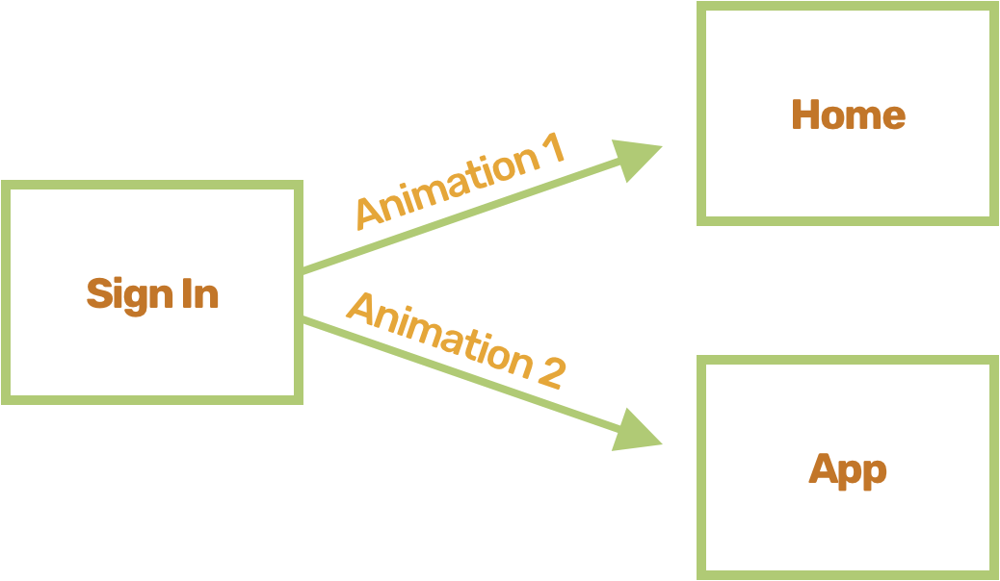

Working on a side-project I wanted to create nice "flow"-y animations for when the user navigates between routes. Routes had to implement different "enter" and "leave" animations depending on which page the user navigates to and from, i.e., navigating from the **Sign In** page to the **Home** page animates differently (the **Sign In** page's _leave_ animation) than from the **Sign In** page to the **App** page.



I ended up with a pretty neat Provider-and-hook duo that works nice with the popular [React Router](https://github.com/ReactTraining/react-router), so I thought I'd package it up nicely and share it.

[See it live here](https://dutzi.github.io/react-route-transition/#/).

## react-route-transition

So [react-route-transition](https://github.com/dutzi/react-route-transition) is the outcome of that weekend's work.

The way it works is dead simple.

It exports a Provider you need to wrap your app with (place it _inside_ of react-router's `Router`).

<div class="sidenote">

Behind the scenes, that Provider simply wraps its children (your app) with a [Context Provider](https://github.com/dutzi/react-route-transition/blob/master/src/TransitionProvider.tsx#L26). It sets up the Context Provider, passing it a push (`history.push`, or react-router's `push` method provided by their `useHistory()` hook) function, location (`window.location`, or react-router's `usLocation()` return value) and an (empty) array of **listeners**.

The two hooks provided by react-route-transition (`useTransition()` and `useTransitionHistory()`) will later read from and write to that context.

</div>

After wrapping your app with it, you can declare how your animations behave. To do so, you call the `useTransition()` hook.

## Describing An Animation

`useTransition()` accepts an object the has a key named `handlers` whose value is an array of **Handlers**.

A Handler is an object that describes:

1. an animation
2. when to fire said animation

A Handler object is comprised of the following keys:

- `path` - a string (or array of strings) specifying which path(s) the animation functions should fire when entering/leaving those paths.
- `onEnter` - an async function that is fired once the user navigates to `path`. This one is where the animation code sits, it should resolve when the animation is done.
- `onLeave` - same as `onEnter`, only this one fires when leaving `path`.

Here's an example of usage of `useTransition()`:

<!-- prettier-ignore -->
```js
useTransition({
  handlers: [
    {
      path: '/',
      onEnter: async () => {
        await gsap  // highlight-line
          .timeline()  // highlight-line
          .fromTo( // highlight-line
            '[data-home-main] > *, [data-home-footer]',  // highlight-line
            { opacity: 0, y: 20 },  // highlight-line
            { duration: 0.6, stagger: 0.125, y: 0, opacity: 1 }  // highlight-line
          )  // highlight-line
      },
      onLeave: async () => {
        await gsap.timeline().to('[data-home-main] > *, [data-home-footer]', {
          duration: 0.6,
          stagger: 0.125,
          opacity: 0,
          y: -20,
        })
      },
    },
  ],
})
```

When _entering_ `/` start **onEnter** animation, when _leaving_, start **onLeave**.

When the component that called `useTransition()` unmounts, the handlers it registered are also removed, so pages no longer in view will not start animating in the background.

Now, if you're unfamiliar with [gsap](https://github.com/greensock/GSAP), it's an old school animation library from the 00's which is still really nice. A great, light-weight alternative is [anime.js](https://github.com/juliangarnier/anime/). They both expose simple APIs that make animating the DOM a breeze and (IMO) produce code that is more readable than one written when using declarative animation libraries (see my disclaimer below).

The first animation block (the highlighted lines) dims out (transitions opacity to 0) all the children of the element that has a data attribute named `home-main` _and_ the element that has a data attribute named `home-footer`. Each of the animated element will animate within 600ms and a stagger effect of 125ms will be applied.

The rendered element for such an animation might look something like:

```jsx
return (
  <div>
    <main data-home-main>{/* this content will be animated */}</main>
    <footer data-home-footer>{/* some stuff here as well */}</footer>
  </div>
)
```

Awaiting `gsap.timeline().to()` means waiting for the animation to complete (its return value is then-able and resolves once it's done animating).

We are now ready to see the animation play.

## Starting Up An Animation

react-route-transition will start an animation when the user navigates to (or from) a page for which an animation was required (in the example above, when the user animates to and from `/`).

The way you navigate pages with react-route-transition is similar to react-router, by calling `history.push('/some-path')`, except the `history` object here is what is returned by `useTransitionHistory()`, a hook provided by react-route-transition.

<div class="sidenote">

react-route-transition handles navigating for you. It exports a hook named `useTransitionHistory()` that returns an object with a single method named `push`, which accepts the path you want to navigate to. That hook [orchestrates the animations](https://github.com/dutzi/react-route-transition/blob/master/src/use-transition-history.ts#L20-L56). When calling push, it goes over the list of registered handlers, finds which ones describe an `onLeave` animation for the current location, fires up all these animations simultaneously, waits for them to complete and then **calls history.push** (react-router's), this causes new components to mount and register their handlers (that may or may not describe `onEnter` animations for this new view). Finally, it fires up all the `onEnter` animations for the new location.

</div>

## 2 Animations 1 View

Say you want one `onLeave` animation to start when the user navigates from the **Sign In** page to the **Home** page but a different one for when the user navigates from the same **Sign In** page to the **App** page.

You can do it by passing a `from` and a `to` options, instead of a passing the `path` option, for example:

```js
useTransition({
  handlers: [
    {
      from: '/signin',
      to: '/app',
      onLeave: async () => {
        // Animation 1
      },
    },
    {
      from: '/signin',
      to: '/',
      onLeave: async () => {
        // Animation 2
      },
    },
  ],
})
```

Will start Animation 1 when leaving to the **App** page, and Animation 2 when leaving to the **Home** page.

Lastly, `path`, `from` and `to` also accept an array of paths. That's useful when you want the same animation to be fired when navigating to (or from) multiple pages.

## Why Imperative Animations?

Personally, I don't like writing complex animations in a declarative manner. They're great for interactions, but I find that compared to animations written in an imperative way, the learning curve is steep, code readability suffers and playing around (just testing stuff out) is not as fun as the feedback loop tends to be longer. That may be because I started my way out as a Flash (ActionScript) developer, where tween animations were very popular, so don't take this as a fact. If you prefer the declarative approach keep at it and please let me know in the comments below, I'd love to hear about their upsides!
