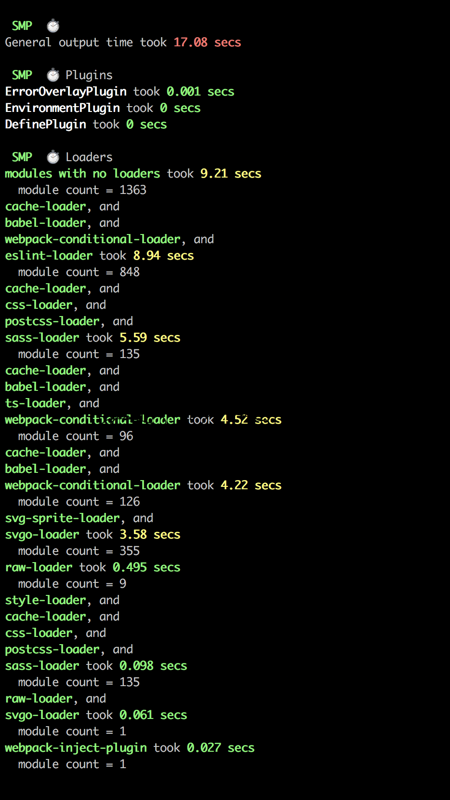

Where I work at (a small-medium startup called [Spot.IM](https://www.spot.im/)) we use Webpack to bundle our products. After about 4 years and who knows how many hands contributing to the source code, our main product's build time reached a staggering **90 seconds** for initial build and **14 seconds** for re-build.

That's 14 seconds you had to wait every time you hit save.

Applying some easy wins which anyone can introduce to their stack we were able to slice those numbers down to **20 seconds** for build and **1 second** for re-build.

In this post I will go through some simple changes you can make to improve your bundle's build time.

<div class="sidenote">

**Note:** If you are using [Create React App](https://github.com/facebook/create-react-app) (or any other fancy app generator) this post probably won't matter that much to you, if not it might help a lot, so keep reading!

</div>

## Measuring Success

Before we do anything, let's set up a way to measure our improvement. To do that we'll use a tool called [`speed-measure-webpack-plugin`](https://www.npmjs.com/package/speed-measure-webpack-plugin):

```ts
const webpackConfig = require('./webpack.config')
const SpeedMeasurePlugin = require('speed-measure-webpack-plugin')

const smp = new SpeedMeasurePlugin({
  disable: !process.env.MEASURE,
})

module.exports = smp.wrap(webpackConfig)
```

We wrap the Webpack config file with SMP (which we enable through an environment variable), later we pass that config object to Webpack, which will then print a nice report specifying each loader's processing time per each build. This way we win in two frontiers, one is that we get immediate feedback to our optimization attempts and the other is that we instantly get a full report of how long each loader (or actually "chain of loaders") took:

<div class="imageWrapper" style="width: 467px">



</div>
<!--  -->

## Improving Initial Build Time

After setting up SMP, we can start seeing how our build time changes as we make improvements, the first thing we'll tackle is the initial build time (i.e., the time it takes for Webpack to bundle our package since it has been initialized), we'll use a loader called `cache-loader` to do that.

[`Cache-loader`](https://github.com/webpack-contrib/cache-loader) is a Webpack loader that caches the results of loaders preceding it on disk (or database). Meaning the _next time_ you run Webpack you'll (hopefully) see a significant improvement.

Set up example:

```tsx
{
  rules: [
    {
      test: /\.jsx?$/,
      use: [
        'cache-loader', // highlight-line
        'babel-loader',
      ],
    },
    {
      test: /\.scss$/,
      use: [
        'style-loader',
        'cache-loader', // highlight-line
        'css-loader',
        'postcss-loader',
        'sass-loader',
      ],
    },
  ]
}
```

Adding it before [`css-loader`](https://www.npmjs.com/package/css-loader) (for CSS) and before [`babel-loader`](https://www.npmjs.com/package/babel-loader/) (for JS) we were able to shave off around **75 seconds** from the initial build time.

Now let's tackle the re-build time, to do that we'll modify a property called `devtool`.

## Webpack Source Maps

Within Webpack's configuration you'll find something called `devtool`, which according to the [docs](https://webpack.js.org/configuration/devtool/) lets you:

> Choose a style of source mapping to enhance the debugging process. These values can affect build and rebuild speed dramatically.

In other words, modifying it will change what type of source maps you'll get, and more importantly, how long you'll have to wait until you get it.

Playing with this one was a life changing experience. I really can't emphasize this enough. We changed it from `source-map` (which is possibly the slowest one) to `eval-source-map` and were able to improve our re-build time from 14 seconds down to 3.5 seconds.

```ts
{
  devtool: process.env.NODE_ENV === 'development'
    ? 'eval-source-map'
    : 'source-map'
}
```

There are 12 different variants, Create React App [uses `cheap-module-source-map`](https://github.com/facebook/create-react-app/blob/master/packages/react-scripts/config/webpack.config.js#L153-L157), so play with it and see what's good for your needs.

What you lose here is the quality of the source maps generated, and you feel the degradation once you start debugging the code. Luckily, browsers right now are keeping up the pace with TC39, so (at least while developing) you don't really need to transpile a lot of your code. If you set Babel up so that it will transpile Javascript to the latest browser version (as [CRA does](https://github.com/facebook/create-react-app/blob/7ac8150af37d4f5617f4218619a2b607f2e20d56/packages/react-scripts/package.json#L98-L102)) you should be fine, as the source maps won't be too far off from the code itself.

Here's how your `babel.config.js` should look like should you want to transpile to the latest browser versions:

```ts
module.exports = {
  presets: [
    [
      '@babel/preset-env',
      {
        targets: [
          'last 1 chrome version',
          'last 1 safari version',
          'last 1 firefox version',
        ].join(', '),
      },
    ],
  ],
  // ...
}
```

And that's it. 3 simple steps and our build time decreased significantly. Next time I will share how we later added Hot Module Replacement, a configuration that helped save precious time and improve the feedback loop we experience while developing.

## Learn From The Best

When approaching such a task, the first idea that comes to mind is to delve in Webpack's docs and see what we could find. But it's not the only one.

A different approach I found, that has really proven itself, was to go through `webpack.config` files of existing open source projects. Specifically, [Create React App's](https://github.com/facebook/create-react-app/blob/master/packages/react-scripts/config/webpack.config.js) one. There's **a lot** you can learn from it.

I will definitely keep this approach, of learning from the best, in mind in future tasks.

## Wait, You Said 1 Second.

You're right!

We were able to slice 2.5 more seconds, but it was by making a bunch of changes that were very domain specific, where the domain I refer to is our (Spot.IM's) needs. So sharing them down here just doesn't make much sense.

<div class="dependencies">

**Dependencies:**
<span class="dep">[speed-measure-webpack-plugin](https://www.npmjs.com/package/speed-measure-webpack-plugin)</span>
<span class="dep">[cache-loader](https://github.com/webpack-contrib/cache-loader)</span>

</div>
